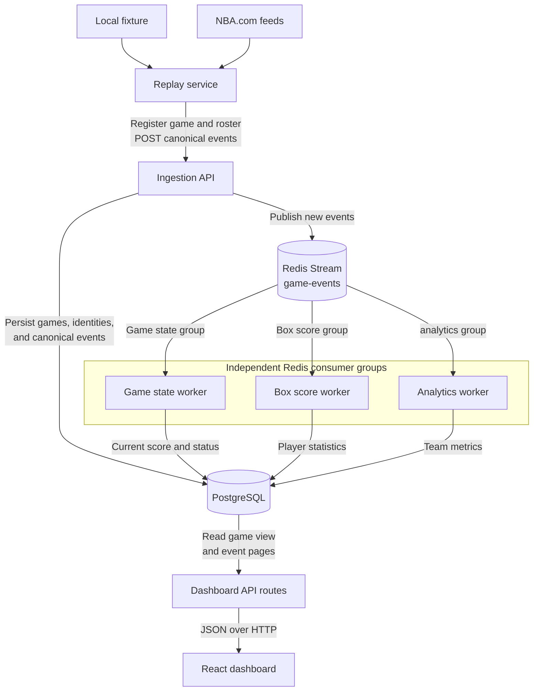

# NBA Live Event Platform

This project processes NBA play by play events with independently scalable backend workers. The goal is to explore event driven systems, failure recovery, and running the same stack locally with Docker and Kubernetes.

## Architecture



## Getting started

- Node.js 22.13 or newer
- pnpm 11

```bash
pnpm install
pnpm check
```

The `check` command runs formatting checks, linting, type checks, tests, and builds.

## How it works

The API stores each accepted event in PostgreSQL and publishes it to Redis.
Three Redis consumer groups process the event independently:

- game state tracks the score, period, clock, and status
- box score builds player statistics
- analytics builds team shooting and turnover totals

Retries, pending message recovery, and a dead letter stream handle worker
failures. PostgreSQL remains the source of truth for accepted events and
derived state.

## Run with Docker

With Docker Desktop running:

```bash
docker compose up --build
```

The API is available at `http://localhost:3000` and the dashboard is available
at `http://localhost:3100`. The replay service loads the sample game once and
then exits; the API and workers keep running.

To load a completed NBA game while the stack is running:

```bash
pnpm --filter @nba-event-platform/replay-service build
pnpm --filter @nba-event-platform/replay-service start -- --nba-history 0022400247
```

Open the dashboard and enter `0022400247`. NBA.com is optional and may reject
automated requests; the bundled fixture does not depend on it.

Stop the stack with:

```bash
docker compose down
```

## Run with Kubernetes

Local Kubernetes manifests are in `infra/kubernetes`. They target a kind
cluster.

### Start an existing cluster

Start Docker Desktop and wait for the existing workloads to become ready:

```bash
kubectl get pods -n nba-event-platform
```

Check the API:

```powershell
Invoke-RestMethod http://localhost:3000/ready
```

Open the dashboard:

```bash
kubectl port-forward service/dashboard 3100:8080 -n nba-event-platform
```

Keep the port forward running and visit `http://localhost:3100`. Existing
PostgreSQL data remains available after restarting Docker Desktop.

Docker Compose and kind use separate PostgreSQL and Redis instances. Data sent
to one environment does not appear in the other.

## Project structure

```text
apps/
  dashboard/     React interface for game results and events
  ingestion-api/ Fastify API for accepting events
  load-test/     Generates and verifies concurrent workloads
  replay-service/ Sends fixture events through the ingestion API
packages/
  database/  PostgreSQL connection and persistence code
  event-bus/ Broker neutral event delivery contracts
  health/    Health server shared by the workers
  schemas/   Shared event schemas and TypeScript types
workers/
  analytics/  Builds game-level analytics from events
  box-score/  Builds player box scores from events
  game-state/ Builds live game state from events
infra/
  kubernetes/ Local kind manifests
data/
  fixtures/   Deterministic sample game
```
